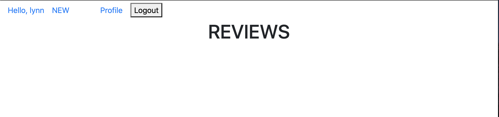

# pjt06

## 1. /community/

 community 경로로 들어가면 메인 페이지는 review_list 페이지로 다음과 같다. 


- Base.html

  ```html
  <!DOCTYPE html>
  <html lang="en">
  <head>
    <meta charset="UTF-8">
    <meta name="viewport" content="width=device-width, initial-scale=1.0">
    <!-- CSS only -->
  <link rel="stylesheet" href="https://stackpath.bootstrapcdn.com/bootstrap/4.5.2/css/bootstrap.min.css" integrity="sha384-JcKb8q3iqJ61gNV9KGb8thSsNjpSL0n8PARn9HuZOnIxN0hoP+VmmDGMN5t9UJ0Z" crossorigin="anonymous">
  
    <title>Document</title>
  </head>
  <body>
  <ul class="nav justify-content-center-end align-items-center">
  
    <li class="nav-item">
    <a class="nav-link" href="">Hello, {{ request.user}}</a>
    
    </li>
    <li>
      <a style="float: right;" class="mr-5" href="">NEW</a>
    </li>
     <li class="nav-item">
      <a class="nav-link" href="">Profile</a>
    </li>
    <li class="nav-item">
      <form action="" method="POST">
      
      <button>Logout</button>
    </form>
      
    </li>
   
  
    
    <li class="nav-item">
      <a class="nav-link active" href="">Signup</a>
    </li>
    <li class="nav-item">
      <a class="nav-link" href="">Login</a>
    </li>
    
  
  
  
  
  </ul>
  
  <div class="container">
    
    
  </div>
  
    <script src="https://code.jquery.com/jquery-3.5.1.slim.min.js" integrity="sha384-DfXdz2htPH0lsSSs5nCTpuj/zy4C+OGpamoFVy38MVBnE+IbbVYUew+OrCXaRkfj" crossorigin="anonymous"></script>
  <script src="https://cdn.jsdelivr.net/npm/popper.js@1.16.1/dist/umd/popper.min.js" integrity="sha384-9/reFTGAW83EW2RDu2S0VKaIzap3H66lZH81PoYlFhbGU+6BZp6G7niu735Sk7lN" crossorigin="anonymous"></script>
  <script src="https://stackpath.bootstrapcdn.com/bootstrap/4.5.2/js/bootstrap.min.js" integrity="sha384-B4gt1jrGC7Jh4AgTPSdUtOBvfO8shuf57BaghqFfPlYxofvL8/KUEfYiJOMMV+rV" crossorigin="anonymous"></script>
  </body>
  </html>
  ```

  

## 2. 회원가입

원하는 기능을 사용하려면 회원가입, 로그인을 해야한다. 


- Signup.html

  ```html
  
  
  
  
  <div class="container mt-5">
    <form action="" method="POST">
      
      {{ form.as_p }}
  <input value="회원가입" type="submit"> 
    </form>
  <a class="btn btn-primary" href="">BACK</a>
  </div>
  
    
  
  ```

- views.py

  ```python
  @require_http_methods(['GET', 'POST'])
  def signup(request):
      if request.user.is_authenticated:
          return redirect('community:review_list')
      if request.method == 'POST':
          form = CustomUserCreationForm(request.POST)
          if form.is_valid():
              user = form.save()
              auth_login(request, user)
              return redirect('community:review_list')
      else:
          form = CustomUserCreationForm()
      context = {
          'form': form,
      }
      return render(request, 'accounts/signup.html', context)
  
  ```

  

## 3. 로그인

처음엔 없었던 'logout' 버튼과 클릭하면 메인 페이지로 넘어가는 'hello, 사용자' 버튼이 생긴다.  



- login.html

  ```html
  
  
  
  <h1>로그인</h1>
  <form action="" method="POST">
    
    {{ form.as_p }}
    <input type="submit">
  </form>
  
  ```

  

## 4. 새 글 작성하기 

새 글을 작성한다. 글의 제목, 영화제목, 랭크, 내용이 포함된다. 


- Forms.py

  ```python
  class ReviewForm(forms.ModelForm):
      
      class Meta: 
          model = Review
          fields = ('title', 'movie_title', 'rank', 'content',)
  
  ```

  

- form.html

  ```html
  
  
  
  
  <div class="container mt-5">
    <form action="" method="POST">
      
      {{ form.as_p }}
      <input type="submit">
    </form>
    <a href="">BACK</a>
  </div>
  
    
  
  ```

  

## 5. 글 작성 완성

글을 작성하고 나면 메인페이지로 돌아가는데 글은 다음과 같이 보인다. 

글의 제목과 작성자 이름을 클릭하면 다음 페이지로 이동한다. 글의 제목을 클릭 시 review_detail 페이지로 넘어가며 작성자의 이름을 클릭하면 작성자의 프로필 화면으로 넘어간다. 


- Review_list.html

  ```html
  
  
  
  <h1 class="text-center">REVIEWS</h1>
  
  
  <div class="container">
    <a href="">{{ review.title }}</a>
    <p>{{ review.movie_title }}</p>
    <p>{{ review.rank }}</p>
    <p>{{ review.content }}</p>
    <p>작성자: <a href="">{{ review.user }}</a></p>
    <hr>
  </div>
  
  
  ```

- views.py

  ```python
  def review_list(request):
      reviews = Review.objects.order_by('-pk')
      context = {
          'reviews':reviews, 
      }
      return render(request, 'community/review_list.html', context)
  
  @login_required
  def review_create(request):
      # POST
      if request.method == 'POST':
          form = ReviewForm(request.POST)
          if form.is_valid():
              review = form.save(commit=False)
              review.user = request.user
              review.save()
              return redirect('community:review_list')
      # GET
      else:
          form = ReviewForm()
      context = {
          'form':form,
      }
      return render(request, 'community/form.html', context)
  ```

  

## 5-1. 글의 제목을 클릭한 경우 

Review_detail 페이지로 넘어가며 글이 작성된 날짜, 수정된 날짜가 뜨고 좋아요 버튼과 댓글 작성 칸이 보인다. 

***생각해보니..... 글을 수정하고 삭제하는 버튼을 만들지 않았네요!!!! 그리고 review_detail에서도 작성자의 이름을 언급해 주는 것이 좋을 것 같아요. 수정하겠습니다.***


본인이 작성한 글도 본인이 좋아요 누를 수 있다. 


- Review_detail.html

  ```html
  
  
  
  <h1 class="text-center">{{ review.pk }}번째 REVIEW</h1>
  
  <div class="container">
    <h3>{{ review.title }}</h3>
    <p>{{ review.movie_title }}</p>
    <p>{{ review.content }}</p>
    <p>{{ review.rank }}</p>
    <p>{{ review.created_at }}</p>
    <p>{{ review.updated_at }}</p>
    <hr>
    <form action="">
      
      <p>좋아요 <b>{{ review.like_users.all|length }}</b></a></p>
      <button class="text-danger">
      
        <svg  width="1em" height="1em" viewBox="0 0 16 16" class="bi bi-heart-fill" fill="currentColor" xmlns="http://www.w3.org/2000/svg">
          <path fill-rule="evenodd" d="M8 1.314C12.438-3.248 23.534 4.735 8 15-7.534 4.736 3.562-3.248 8 1.314z"/>
        </svg>
      </button>
        <div class="d-flex">
        
   
    </div>
    
      
      <p>좋아요 <b>{{ review.like_users.all|length }}</b></a></p>
        <button>
        <svg width="1em" height="1em" viewBox="0 0 16 16" class="bi bi-heart-fill" fill="currentColor" xmlns="http://www.w3.org/2000/svg">
          <path fill-rule="evenodd" d="M8 1.314C12.438-3.248 23.534 4.735 8 15-7.534 4.736 3.562-3.248 8 1.314z"/>
        </svg>
      </button>
      
    </form>
    <!-- comments_list -->
    
      <li>
        {{ comment.user }} - {{ comment.content }}
        
          <!-- comments_delete -->
          <form action="" method="POST" class="d-inline">
            
            <input type="submit" value="DELETE">
          </form>
        
      </li>
    
      <p>댓글을 작성해주세요.</p>
    
    <hr>
    <!-- comment_form -->
    
    <form action="" method="POST">
      
      {{ comment_form.as_p }}
      <input type="submit">
    </form>>
    
    <a href="">BACK</a>
  
  </div>
  
  
  ```

- views.py

  ```python
  def review_detail(request, review_pk):
      comments = Comment.objects.all()
      comment_form = CommentForm()
      review = get_object_or_404(Review, pk=review_pk)
      context = {
          'review':review, 
          'comments':comments,
          'comment_form':comment_form,
      }
      return render(request, 'community/review_detail.html', context)
  
  ```

  

lynn이 작성한 글에 lynn으로 로그인 한 후 좋아요와 댓글을 남긴 모습은 아래와 같음.


- views.py

  ```python
  @require_POST
  def comments_create(request, review_pk):
      # POST
      if request.user.is_authenticated:
          review = get_object_or_404(Review, pk=review_pk)
          comment_form = CommentForm(request.POST)
          if comment_form.is_valid():
              comment = comment_form.save(commit=False)
              comment.review = review
              comment.user = request.user
              comment.save()
              return redirect('community:review_detail', review.pk)
      # GET
          context = {
              'review':review, 
              'comment_form':comment_form,
          }
          return render(request, 'community/review_detail.html', context)
      return redirect('accounts:login')
  
  
  
  @require_POST
  def comments_delete(request, review_pk, comment_pk):
      review = get_object_or_404(Comment, pk=review_pk)
      comment = get_object_or_404(Comment, pk=comment_pk)
      if request.user.is_authenticated:
          if request.user == comment.user:
              comment.delete()
              return redirect('community:review_detail', review.pk)
  
  
  def like(request, review_pk):
      # 좋아요가 눌려져있으면 좋아요를 해제!
      review = get_object_or_404(Review, pk=review_pk)
      if not request.user.is_authenticated:
          return redirect('accounts:login')
      # 로그인이 되어있지 않으면 로그인 페이지로 돌아간다.
      if review.like_users.filter(pk=request.user.pk).exists():
          review.like_users.remove(request.user)
      else: 
          review.like_users.add(request.user)
      return redirect('community:review_detail', review.pk)
      # 아니라면, 좋아요 추가!
  ```

  - models.py 

    ```python
    from django.db import models
    from django.contrib.auth import get_user_model
    from django.conf import settings
    # Create your models here.
    class Review(models.Model):
        title = models.CharField(max_length=100)
        movie_title = models.CharField(max_length=50)
        rank = models.IntegerField()
        content = models.TextField()
        created_at = models.DateTimeField(auto_now_add=True)
        updated_at = models.DateTimeField(auto_now=True)
    
        user = models.ForeignKey(settings.AUTH_USER_MODEL, on_delete=models.CASCADE)
        like_users = models.ManyToManyField(
            settings.AUTH_USER_MODEL,
            related_name = 'like_reviews'
        )
    
    
    class Comment(models.Model):
        user = models.ForeignKey(settings.AUTH_USER_MODEL, on_delete=models.CASCADE)
        content = models.CharField(max_length=100)
        review = models.ForeignKey(Review, on_delete=models.CASCADE)
    ```

    

## 5-2. 작성자 이름을 클릭한 경우 

기본적으로 '안녕하세요! {작성자}입니다!' 라는 문구가 프로필 정보에 표시되고 이를 본인 프로필 페이지에서 수정할 수 있다. 프로필 정보 아래에는 작성자가 지금까지 쓴 게시물의 수, 팔로워, 팔로잉 수가 표시된다. 

그리고 게시물과 댓글의 상세 정보도 확인할 수 있다. 


프로필정보글을 수정할 수 있고, 


댓글을 작성하고 나니 lynn이 쓴 댓글을 프로필 페이지에서 확인할 수 있다.  


introduce 를 만들기 위해 model 을 수정해줌.

- models.py에 introduce 추가 

  ```python
  class User(AbstractUser):
      introduce = models.CharField(max_length=50, blank=True)
      followings = models.ManyToManyField('self', symmetrical=False, related_name='followers')
  ```

- forms.py 에 ProfileIntroduce추가

  ```python
  class ProfileIntroduce(forms.ModelForm):
  
      class Meta:
          model = get_user_model()
          fields = ('introduce',)
  ```

  

- profile.html

  ```html
  
  
  
  
  <div class="jumbotron">
    <h1 class="display-4">{{ person.username }}의 프로필</h1>
      
        <p>{{ person.introduce }}</p>
      
        <p>안녕하세요! {{ person.username}} 입니다! </p>
      
    
    
    <form action="" method="POST">
      
      {{ form }}
      <input value="프로필정보 수정하기" type="submit">
    </form>
    
    
    
    
  
  
    <hr class="my-4">
    <!-- follow/ unfollow-->
    <div class="d-flex">
    <p> <a href="">게시물 <b>{{ person.review_set.all|length }}</b></a></p>
    <p class="ml-5"><a href="">팔로워<b> {{ person.followers.all|length }} </b></a></p>
    <p class="ml-5"><a href="">팔로잉<b> {{ person.followings.all|length }} </b></a></p>
    
    </div>
    
      
      <form action="" method="POST">
        
       
         <button class="btn btn-secondary">Unfollow</button>  
       
         <button class="btn btn-primary">Follow</button>  
       
      </form>
      
   </div>
  
  
  <div class="card" style="width: 42rem;">
      
    <div class="card-body">
      <h5 class="card-title">{{ person.username}} 님이 작성한 REVIEW</h5>
      <hr style="border:solid 1px">
      <p class="card-text">
      
    <p>{{ review.pk }}번째 REVIEW- {{ review.title}} </p>
      <p>제목: {{review.movie_title}}</p>
      <p>내용: {{review.content}}</p>
      <hr>
  
  </p>
    
  
      <h5 class="card-title">{{ person.username}} 님이 작성한 COMMENT </h5>
      <hr style="border:solid 1px">
      <p class="card-text">
    <p>{{ comment.pk }}번째 COMMENT - {{ comment.content}} </p>
  </p>
  
  
      <h5 class="card-title">{{ person.username}} 님이 좋아요 한 REVIEWS</h5>
      <hr style="border:solid 1px">
      <p class="card-text">
      
        <p>{{ review.title }} </p>
      </p>
        <a href="" class="btn btn-primary">BACK</a>
    </div>
  </div>
  
  
  
  
  
  
  
  <a href=""></a>
  
  
  ```

- views.py

  ```python
  def profile(request, username):
      User = get_user_model()
      person = get_object_or_404(User, username=username)
      # POST
      if request.method == "POST":
          form = ProfileIntroduce(request.POST, instance=request.user)
          if form.is_valid():
              form.save()
              return redirect('accounts:profile', username=username)
      # GET 
      else:
          form = ProfileIntroduce()
      context = {
          'person':person,
          'form': form,
      }
      return render(request, 'accounts/profile.html', context)
  
  ```

  

## 6. 다른 사용자로 로그인

jay로 회원가입을 진행한 후 


좋아요를 누르면 좋아요 수가 늘어나는 것을 확인할 수 있고 jay가 남긴 댓글만 삭제할 수 있다. 


jay가 lynn의 프로필에 들어가면 수정할 수 있는 칸은 보이지 않고 follow 버튼이 활성화되어있다. 


follow를 하면 lynn의 프로필 상의 팔로워가 1 증가하고 follow버튼은 unfollow 버튼으로 바뀐다. 


- followers.html

  ```html
  
  
  
  
  <div class="mt-5 text-center">
  <h1>FOLLOWERS 목록 </h1>
  <ul class="list-group">
  
    <li class="list-group-item"> <p>{{ follower }}</p> 
    <p>{{ following.user.username }}</p> 
   
  
  </li>
  </ul>
  
  </div>
  
  
  ```

  

- followings.html

  ```html
  
  
  
  
  <div class="container mt-5">
  <h1 class="text-center">FOLLOWINGS 목록 </h1>
  <ul class="list-group">
  
  <li class="list-group-item"> 
  <p><b>{{ following }}</b></p> 
  <p>안녕하세요. {{ following }}입니다!</p></li>
  </ul>
  </div>
  
  
  ```

  

- views.py

  ```python
  def follow(request, user_pk):
      you = get_object_or_404(get_user_model(), pk=user_pk)
      me = request.user
      if not request.user.is_authenticated:
          return redirect('accounts:login')
      # 나는 나 자신을 팔로우 할 수 없다. 
      if me != you:
      # 내가 상대방을 팔로우하고 있다면, 언팔을 하고 
          if you.followers.filter(pk=me.pk).exists():
              you.followers.remove(me)
      # 그렇지 않다면 팔로우를 한다.         
          else: 
              you.followers.add(me)
      return redirect('accounts:profile', you.username)
  
  
  def followers(request, user_pk):
      user = get_object_or_404(get_user_model(), pk=user_pk)
      users = user.followers.all()
      context = {
          'users':users,
      }
      return render(request, 'accounts/followers.html', context)
  
  
  def followings(request, user_pk):
      user = get_object_or_404(get_user_model(), pk=user_pk)
      users = user.followings.all()
      context = {
          'users':users,
      }
      return render(request, 'accounts/followings.html', context)
  
  
  ```

  

> 프로젝트 5를 하면서까지도 도움없이는 내가 만들고 싶은 것을 구현하기 어려웠는데 이번 pjt06은 이런 부분이 고쳐졌으면 좋겠고 이런 기능이 있으면 좋겠다는 생각을 스스로 하면서 혼자서 구현한 부분이 많아서 뿌듯했어요! 프로젝트하면서 처음으로 즐거웠어요...헤헤... 놓지 않고 많이 알려준 수완이와 민교쌤께 감사한 프로젝트날이었습니다. 
>
> 해시태그는 일요일에 수완이를 만나서 추가하기로 했는데 디자인적인 부분도 수정할 계획입니다. 그리고 리드미를 쓰면서 보니까 있어야 할 작은 부분들의 부재가 느껴져서 내일 그 부분도 고쳐볼까해요. 